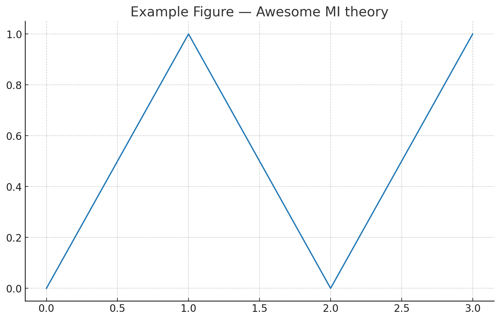

# Introduction to Mutual Information

Mutual Information (MI) between random variables $X$ and $Y$ is

$$ I(X;Y) = \mathbb{E}_{p(x,y)}\Bigg[ \log \frac{p(x,y)}{p(x)\,p(y)} \Bigg]. $$

Inline math example: $H(X) = -\sum_x p(x)\log p(x)$.

> Tip: put your images into `docs/assets/images/` and reference them with relative paths.
